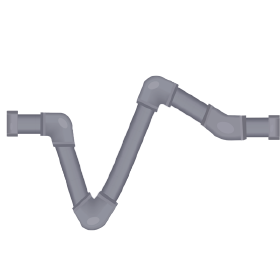

# SpikeInterface events

This website contains all information related to courses, conferences, and events revolving around the [SpikeInterface](https://spikeinterface.readthedocs.io/en/latest/) project.

## Upcoming events

- [SpikeInterface Workshop](spikeinterface-workshop-2023/) - Lisbon, Portugal, 26-30th June 2023

## Past events

- [Spike Sorting Hackathon](https://catalystneuro.github.io/spike-sorting-hackathon/) - New York City, NY, USA, 6-10th June 2022

- [Spike Sorting and Reproducibility for Next Generation Electrophysiology](https://workshops.inf.ed.ac.uk/ssnge/) - Edinburgh, Scotland, 24-25 June 2019
