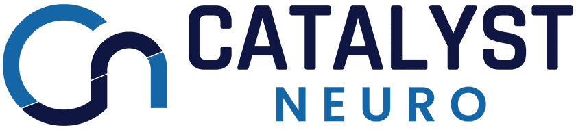
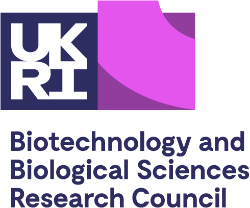
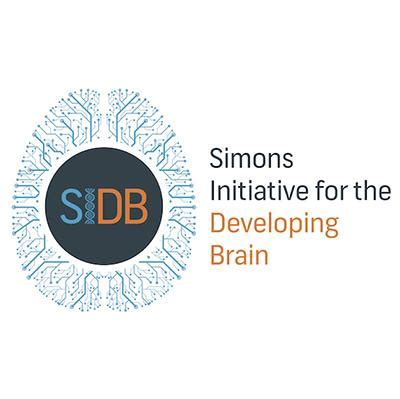
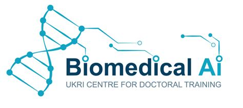
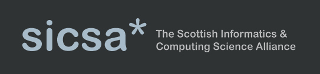
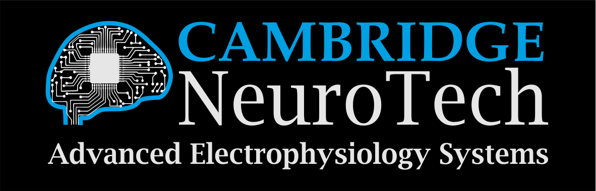

# Tools and Methods for Next Generation Electrophysiology

**A workshop on tools and methods for analysis of extracellular electrophysiologiocal recordings.**

Workshop: 27-28 May 2024  
Hackathon: 29-31 May 2024  
Informatics Forum  
University of Edinburgh 

* Do you acquire or analyse extracellular electrophysiology data in your research? 

* Do you develop analysis tools and software for electrophysiology?

* Are you excited about open-source initiatives and electrophysiology community building?

If you answered yes to any of these questions, we invite you to attend this event.

This workshop will bring together electrophysiologists and developers of tools for the analysis of extracellular recordings to discuss recent developments and future needs in the field. The event 
consists of a two-day workshop, followed by a three-day hackathon for those interested in contributing to the development of [SpikeInterface](https://spikeinterface.readthedocs.io/en/latest/).

On the second day, we will offer an in-depth training session on electrophysiology analysis, including advanced pre- and post-processing of data, drift correction, quality control, visualisation options, and more. This session will both introduce concepts, and also offer hands-on tutorials using [SpikeInterface](https://spikeinterface.readthedocs.io/en/latest/) to demonstrate analysis workflows and show successes and failure modes of common methods.

## Programme

### 27 May: Talks and Posters

- 9:30 - 10:00: *Welcome coffee*
- 10:00 - 10:45: **Andrew Shelton** (Allen Institute) - "Ultra-high-density electrodes improve detection, yield, and cell type specificity of brain recordings"
- 10:45 - 11:30: **Gabe Stine** (MIT) - "A new era for primate neuroscience with NHP Neuropixels"
- 11:30 - 12:15: **Luca Berdondini** (IIT Genova) - "Implantable SiNAPS-probes for electrophysiology at high spatiotemporal resolution: technology, performances and perspectives"
- 12:15 - 13:30: *Lunch break*
- 13:30 - 14:15 **Charlie Windolf** and **Cole Hurwitz** (Columbia) - "Drift-aware electrophysiology with DREDge and DARTsort"
- 14:15 - 15:00 **Pierre Yger** (Institut de la Vision) - "Spike Sorting with a modular and collaborative approach"
- 15:00 - 15:30 *Coffee break*
- 15:30 - 16:15 **Olivier Winter** (Champalimaud) - "Lessons from applying spike sorting on thousands of Neuropixel recordings at IBL"
- 16:15 - 17:00 **Luiz Tauffer** (CatalystNeuro) - "DENDRO: Analyze neuroscience data in the cloud"
- 17:00 - 20:00 *Reception and posters*

### 28 May: Training Workshop

**SpikeInterface training session** 
Hands-on with spikeinterface! There will be an overview of the spikeinterface package, then focused mini-sessions on particular parts of the software. There will be a chance to show your code to spikeinterface developers who can help you get it working, or give advice on how it can be improved.

Additional information on the training session can be found [here](https://github.com/SpikeInterface/SpikeInterface-Training-Edinburgh-May24/blob/main/README.md).

**Research Software Engineering in Neuroscience 12:30-14:00** 
A satellite event: a lunchtime launch of the Scottish Neuroscience Software Network. Hear perspectives from people at different career stages and from different disciplines, followed by a discussion. What does a research software engineer do? How can you become one? And how can PIs support these roles?

**Additional sessions TBC**

### 29-31 May: Hackathon

The remainder of the event is a developer hackathon. Projects will include both core development of SpikeInterface, addition of new features and functionalities, and development of third party software integrated into the SpikeInterface ecosystem. The developer hackathon is targeted for active contributors/developers of tools for electrophysiology data analysis.

The list of proposed projects can be found [here](https://github.com/SpikeInterface/SpikeInterface-Hackathon-Edinburgh-May24/issues).

## Registration

Attending the workshop is free, but you need to register here:
[Registration link](https://forms.gle/iaBgEuw24wzzhJpF8)

At time of registration you can also express interest for presenting a poster. Registration will close on May 13th 2024. Please contact Matthias Hennig (m.hennig@ed.ac.uk) if you need an invitation letter for visa purposes.

Maximum capacity:
* **Workshop (day 1-2)**: 100 attendees
* **Hackathon (day 3-4-5)**: 25 attendees

## Venue

The workshop will take place in the [Informatics Forum ](https://en.wikipedia.org/wiki/Informatics_Forum) in the centre of Edinburgh. The address is 10 Crichton Street, EH8 9AB. Note that house numbers in Crichton Street have base 2 encoding! 

The Hackathon will take place in [40 George Square](https://www.uoecollection.com/conferences-events/venue-hubs/old-town-campus/40-george-square/), just around the corner from the Forum.

Both are a short walk from the train station (Waverley) and Princess Street, where the airport tram and bus stop.

## Code of conduct

Please read the [code of conduct](code-of-conduct/) for the workshop.

## Organizing Committee and Contact

* Matthias Hennig - University of Edinburgh ([m.hennig@ed.ac.uk](mailto:m.hennig@ed.ac.uk)) 
* Alessio Buccino - Allen Institute for Neural Dynamics ([alessio.buccino@alleninstitute.org](mailto:alessio.buccino@alleninstitute.org))
* Samuel Garcia - CNRS Lyon ([samuel.garcia@cnrs.fr](mailto:samuel.garcia@cnrs.fr))

## Acknowledgements

This workshop is supported by the following sponsors:

Image Credit: [Wolf De Wulf](https://www.wolfdewulf.eu/)
