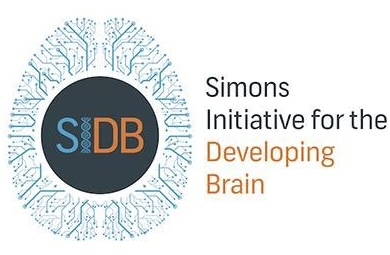

# Tools and Methods for Next Generation Electrophysiology

**A workshop on tools and methods for analysis of extracellular electrophysiologiocal recordings.**

Workshop: 27-28 May 2024  
Hackathon: 29-31 May 2024  
Informatics Forum  
University of Edinburgh 

* Do you acquire or analyse extracellular electrophysiology data in your research? 

* Do you develop analysis tools and software for electrophysiology?

* Are you excited about open-source initiatives and electrophysiology community building?

If you answered yes to any of these questions, we invite you to attend this event.

This workshop will bring together electrophysiologists and developers of tools for the analysis of extracellular recordings to discuss recent developments and future needs in the field. The event 
consists of a two-day workshop, followed by a three-day hackathon for those interested in contributing to the development of [SpikeInterface](https://spikeinterface.readthedocs.io/en/latest/).

On the second day, we will offer an in-depth training session on electrophysiology analysis, including advanced pre- and post-processing of data, drift correction, quality control, visualisation options, and more. This session will both introduce concepts, and also offer hands-on tutorials using [SpikeInterface](https://spikeinterface.readthedocs.io/en/latest/) to demonstrate analysis workflows and show successes and failure modes of common methods.

## Programme

### 27 May - talks and posters

- Andrew Shelton (Allen Brain) - Neuropixels-Ultra
- Cole Hurwitz (Columbia) - DartSort and Dredge
- Luca Berdondini (IIT Genova) - SiNAPS probes
- Olivier Winter (Champalimaud) - International Brain Lab data and processing pipeline
- Pierre Yger (INSERM) / Samuel Garcia (CNRS) - SortingComponents + Spyking Circus2
- Gabe Stine (MIT) - Non-Human Primate (NHP) Neuropixels
- Luiz Tauffer (CatalystNeuro) - Spike sorting cloud deployments

### 28 May: Training Workshop

- SpikeInterface training session
- Research Software Engineer gathering
- More tba

### 29-31 May: Hackathon

The remainder of the event is a developer hackathon. Projects will include both core development of SpikeInterface, addition of new features and functionalities, and development of third party software integrated into the SpikeInterface ecosystem. The developer hackathon is targeted for active contributors/developers of tools for electrophysiology data analysis.

## Registration

Attending the workshop is free, but you need to register here:
[Registration link](https://forms.gle/iaBgEuw24wzzhJpF8)

At time of registration you can also express interest for presenting a poster. Registration will close on May 13th 2024. Please contact Matthias Hennig (m.hennig@ed.ac.uk) if you need an invitation letter for visa purposes.

Maximum capacity:
* **Workshop (day 1-2)**: 120 attendees
* **Hackathon (day 3-4-5)**: 25 attendees

## Code of conduct

Please read the [code of conduct](code-of-conduct/) for the workshop.

## Organizing Committee and Contact

* Matthias Hennig - University of Edinburgh ([m.hennig@ed.ac.uk](mailto:m.hennig@ed.ac.uk)) 
* Alessio Buccino - Allen Institute for Neural Dynamics ([alessio.buccino@alleninstitute.org](mailto:alessio.buccino@alleninstitute.org))
* Samuel Garcia - CNRS Lyon ([samuel.garcia@cnrs.fr](mailto:samuel.garcia@cnrs.fr))

## Sponsors and Acknowledgements

more TBC

Image Credit: [Wolf De Wulf](https://www.wolfdewulf.eu/)
